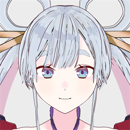
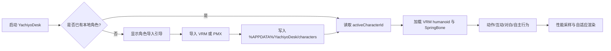

# ✦ YachiyoDesk · 八千代桌面伴侣 ✦

<div align="center">
  
  <p><strong>让一个高质量 VRM 角色住在你的桌面上</strong></p>
  <p>透明窗口 · 自主行走 · 自然动作 · VRM 导入 · PMX 本机转换 · 本地优先</p>
  <p>
    <a href="https://github.com/earth34online/YachiyoDesk/releases"></a>
    <a href="https://github.com/earth34online/YachiyoDesk/releases"></a>
    <a href="LICENSE"></a>
    <a href="https://github.com/earth34online/YachiyoDesk/actions"></a>
  </p>
</div>

> **公开版说明**：仓库和 Release 发布的是软件代码与 Windows 构建包，不包含受限制的角色模型。首次启动没有模型是预期行为，请按照 [首次启动与日常操作](#首次启动与日常操作) 导入你有权使用的角色。

YachiyoDesk 是一个 Windows 本地桌面伴侣：使用 Electron + Three.js + `@pixiv/three-vrm` 渲染 VRM 角色，提供透明桌面窗口、拖动、点击互动、平滑待机/行走、动作与对白、状态面板、角色切换，以及在本机把 PMX 转换成 VRM 后导入。

> 你可以把它当作一个可扩展的本地角色运行时：模型属于你自己，程序负责加载、动作、交互、窗口和配置。

## ✨ 功能一览

| 模块 | 能力 | 说明 |
| --- | --- | --- |
| 桌面窗口 | 透明、无边框、置顶、边缘限制 | 不遮挡桌面，支持拖动和位置记忆 |
| 自主行为 | 底部行走、巡逻/随机方向、动作插播 | 无操作约 15 秒后恢复活动 |
| 人体动作 | 待机、走路、挥手、鞠躬、伸展、跳舞、思考、下蹲等 | 通用 VRM humanoid 骨骼映射，缺失骨骼时安全降级 |
| 互动系统 | 摸头、身体互动、拖动、右键面板、快捷互动栏 | 点击人物会立即中断自主行走 |
| 对白系统 | 角色对白、状态对白、随机闲聊 | 内容来自角色 manifest，可按角色替换 |
| 宠物状态 | 饱腹、精力、心情、亲密度 | 本地持久化，不联网上传 |
| 角色库 | 多角色、VRM 导入、角色切换、删除 | 角色存放于用户数据目录 |
| PMX 导入 | 本机 Blender PMX/PMD → VRM | 不上传原始 PMX，转换结果只保存在本机 |
| 画质与性能 | Ultra/High/Balanced、自适应像素倍率 | 保留模型纹理，不用低模替代高质量模型 |
| 系统集成 | 系统托盘、桌面快捷方式、开机启动选项 | 可在设置中关闭，不强制常驻 |

### 一分钟理解运行流程



## 目录

- [下载并运行](#下载并运行)
- [首次启动与日常操作](#首次启动与日常操作)
- [八千代模型：来源、署名和版权边界](#八千代模型来源署名和版权边界)
- [角色优先级与兼容性](#角色优先级与兼容性)
- [给想自己修改的开发者](#给想自己修改的开发者)
- [更多文档](#更多文档)
- [诊断与安全提示](#诊断与安全提示)
- [许可](#许可)

## 🔗 更多文档

| 文档 | 用途 |
| --- | --- |
| [安装与角色导入指南](docs/INSTALLATION.md) | 从下载校验到 VRM/PMX 导入、Blender 配置、迁移和常见问题 |
| [架构与扩展点](docs/ARCHITECTURE.md) | 了解主进程、renderer、动作系统、manifest 和通用角色标准 |
| [变更记录](CHANGELOG.md) | 查看版本功能、版权策略和后续方向 |
| [安全与隐私](SECURITY.md) | 报告路径穿越、远程执行、资产泄露等安全问题 |

如果你只想使用程序，阅读“下载并运行”和[安装与角色导入指南](docs/INSTALLATION.md)即可；如果你想改动作、增加角色或调整 PMX 映射，再阅读[架构与扩展点](docs/ARCHITECTURE.md)。

## 下载并运行

从 [Releases](https://github.com/earth34online/YachiyoDesk/releases) 下载最新版本：

- [便携版 Portable](https://github.com/earth34online/YachiyoDesk/releases/latest/download/YachiyoDesk-1.0.0-x64-Portable.exe)：下载后直接运行，不写入安装目录。
- [安装版 Setup](https://github.com/earth34online/YachiyoDesk/releases/latest/download/YachiyoDesk-1.0.0-x64-Setup.exe)：按向导安装，可创建桌面和开始菜单快捷方式。
- `SHA256SUMS.txt`：校验下载文件完整性。PowerShell 可运行 `Get-FileHash .\YachiyoDesk-1.0.0-x64-Portable.exe -Algorithm SHA256`。

首次公开版启动时不会内置八千代模型。请点击“打开角色库并导入”，导入你有权使用的 `.vrm`，或导入 `.pmx` 让本机转换器生成 VRM；之后在角色库中点击“使用”。模型会保存在 `%APPDATA%\YachiyoDesk\characters`，下次启动会自动使用已选择的角色。软件本身默认保持 35% 显示比例、透明置顶窗口和开机启动设置，可在设置面板中调整。

### 首次启动与日常操作

1. 启动便携版或完成安装后启动安装版。
2. 首次出现“需要本地角色”时，点击“打开角色库并导入”。选择 VRM，或在已配置 Blender 的情况下选择 PMX 自动转换。
3. 在“角色库”卡片上点击“使用”。程序会重新载入角色，之后仍可从托盘菜单或设置面板切换角色。
4. 左键按住角色可拖动窗口；点击角色会立即停止自主行走并触发对应部位互动；滚轮在角色上调整大小；右键打开动作与设置面板。
5. 将鼠标移到角色附近可打开快捷互动栏；点击面板外部会关闭面板。无操作约 15 秒后，若开启“屏幕底部自主活动”，角色会恢复行走并穿插待机动作。
6. 托盘图标可打开设置、角色库、数据目录、重置姿态或退出。设置中的“开机自动启动”可随时关闭，不会影响模型文件。

导入角色和转换结果仅写入当前 Windows 用户的数据目录，不会自动上传到 GitHub 或其他服务器。删除角色前请确认没有需要保留的本地转换结果。

## 八千代模型：来源、署名和版权边界

仓库和 Release **不包含八千代的 VRM、PMX、纹理或模型压缩包**。本地随项目保存的 `characters/yachiyo/MODEL_LICENSE.txt` 明确规定“再配布：NG”，因此不把模型数据上传到 GitHub，避免让使用者或维护者违反原作者条款。

八千代模型请从原作者水色の描提供的页面获取，并以下载页面当前的条款为准：

- [VRoid Hub](https://hub.vroid.com/users/98041368)
- [ニコニ立体](https://3d.nicovideo.jp/users/134997762)
- [BowlRoll](https://bowlroll.net/user/1004051)
- [BOOTH](https://mizuirononeko.booth.pm)

使用时必须保留原作者署名“水色の描”。当前许可文件还限制暴力、R-18、法人/个人商用和再分发，并允许改编；原作及相关角色权利仍归各权利人所有。若下载页的最新许可与仓库中的副本不同，应遵守最新许可。请不要把下载后的模型、纹理或改造后的模型提交到本仓库、Release、网盘或其他公共渠道。

## 角色优先级与兼容性

1. **原作者提供、与本软件直接匹配的 VRM**：优先推荐，保留原始材质、表情、人体骨骼和 VRM SpringBone，动作与衣物物理质量最好。
2. **其他标准 VRM 1.0/0.x**：可通过“导入 VRM”使用。软件会读取 humanoid 骨骼并应用通用动作；缺失骨骼、非标准命名、没有 SpringBone 或表情的模型会自动降级，可能没有完整脚步、手掌朝向、视线或衣物摆动。
3. **PMX/PMD 本机转换**：通过“导入 PMX（自动转换）”调用本地 Blender 转换器。需要安装 Blender 4.x，并在设置或环境变量 `YACHIYO_BLENDER_PATH` 指向 `blender.exe`；转换会尽力映射人体骨骼、材质和物理，但 PMX 的非标准骨骼、刚体、Morph、复杂裙摆、特殊 toon 材质无法保证完全等价。转换后的结果存入用户数据目录，原 PMX 不会上传。

通用动作会根据模型能力自适应；八千代专属微调只在八千代 manifest 中启用，不会污染未来导入角色。任何第三方角色都应由使用者自行确认模型许可、二次创作规则和再分发限制。

## 给想自己修改的开发者

### 环境

- Windows 10/11
- Node.js 20+（推荐当前 LTS）和 npm
- 若需要 PMX 转换：Blender 4.x，并安装/配置 `YACHIYO_BLENDER_PATH`

### 获取源码并运行

```powershell
git clone https://github.com/earth34online/YachiyoDesk.git
cd YachiyoDesk
npm ci
npm run verify
npm run start
```

`npm run verify` 会执行 TypeScript 类型检查、Vitest 单元测试和 Vite 渲染器构建。开发调试可使用 `npm run electron:dev`（先另开终端运行 `npm run dev`）。

### 本地准备八千代或其他角色

不要把模型放进 Git。将你从原作者合法获取的 `model.vrm` 通过软件“角色库 → 导入 VRM”导入；或者使用 PMX 导入功能。开发者也可以在本地构建前将自己的模型放到 `characters/yachiyo/model.vrm`，但该文件会被 `.gitignore` 忽略，且不得提交或发布。公开构建故意不包含模型，首次运行的引导页就是预期行为。

PMX 转换器默认搜索常见的 Blender 4.x 安装位置，也可以显式设置：

```powershell
$env:YACHIYO_BLENDER_PATH = 'C:\Program Files\Blender Foundation\Blender 4.5\blender.exe'
```

转换时请把 PMX、同目录的纹理、`.pmd/.sph/.spa` 等依赖文件保留在原目录；转换完成后只将生成的 VRM 复制到应用数据目录，原始 PMX 不会被仓库收集。

### 构建发布包

```powershell
npm run dist:portable   # 便携版
npm run dist            # 便携版 + NSIS 安装版
```

构建产物在 `release/`。发布前请确认 `git ls-files` 中不存在 `.vrm/.pmx/.zip`、纹理、`node_modules`、`release` 或本地工具目录；大于 100 MiB 的安装包应作为 GitHub Release asset 上传，而不是普通 Git blob。发布说明应再次写明模型不随包分发、原作者来源和许可边界。

### 代码结构

- `electron/main.cjs`：主进程、透明窗口、托盘、设置持久化、角色库、VRM/PMX 导入 IPC。
- `electron/pmx-converter.cjs`、`converter/pmx_to_vrm.py`：调用 Blender 的本机 PMX→VRM 转换流程。
- `src/AvatarRuntime.ts`：Three.js/VRM 加载、相机、物理、渲染循环和性能自适应。
- `src/ProceduralAnimator.ts`：通用人体动作、走路步态、手掌/肘部约束和角色动作。
- `src/AppUI.ts`、`src/InteractionController.ts`：设置面板、角色管理、拖动和鼠标互动。
- `characters/yachiyo/character.json`：八千代行为和动作配置；模型文件刻意不在仓库中。

### 提交前自检

```powershell
npm run verify
git diff --check
git ls-files | Select-String '\.(vrm|pmx|pmd|zip|7z|rar)$'
```

最后一条命令应无输出。发布构建时还应检查 `release/` 只作为 Release asset 使用，不要 `git add` 进普通提交。

## 诊断与安全提示

如果启动显示“首次启动需要本地角色”，这是公开版的版权保护设计，不是程序损坏。导入模型后点击“使用”会重新加载角色。若 PMX 转换失败，先确认 Blender 路径、模型目录中的纹理文件和读写权限；VRM 导入失败则检查文件是否为有效 VRM/GLB 2.0。软件只在本机保存导入角色和日志，不会自动上传模型。

## 许可

YachiyoDesk 软件源代码采用 [MIT License](LICENSE)。第三方运行库见 [THIRD_PARTY_NOTICES.md](THIRD_PARTY_NOTICES.md)。八千代及任何其他角色资产不属于本软件许可证范围，必须遵守各自原作者许可；八千代具体条款见 [`characters/yachiyo/MODEL_LICENSE.txt`](characters/yachiyo/MODEL_LICENSE.txt)。
