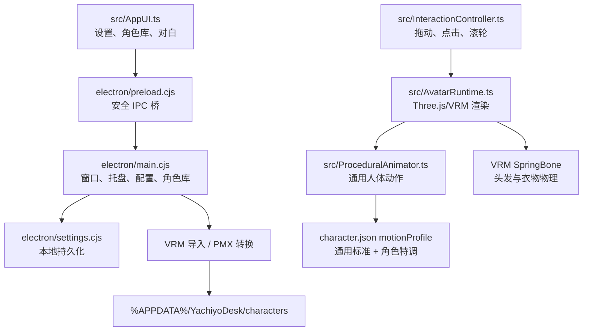

# 架构与扩展点

YachiyoDesk 将“桌面窗口控制”“角色资产管理”“VRM 运行时”“动作系统”和“UI”分层。这样八千代的特调参数可以留在角色 manifest 中，未来导入的任意 VRM/PMX 仍然走通用标准。

## 分层关系



## 主进程

`electron/main.cjs` 负责：

- 创建透明、无边框、置顶的窗口；
- 约束窗口位置不超过当前显示器边界；
- 处理拖动、自主移动、点击中断和 15 秒恢复；
- 保存设置、焦点计时和宠物状态；
- 扫描内置角色与 `%APPDATA%` 下的用户角色；
- 校验 VRM，调用 Blender 完成 PMX→VRM；
- 通过 tray/menu 向 renderer 发送动作和设置命令。

主进程永远不把用户模型上传到网络。`appasset://` 只读取打包资源，`user-characters://` 只允许读取经过路径校验的用户角色目录。

## Renderer 与 VRM 运行时

`src/AvatarRuntime.ts` 负责：

1. 创建透明 WebGLRenderer 和灯光；
2. 使用 `GLTFLoader + VRMLoaderPlugin` 读取 VRM；
3. 清理不必要顶点；只对原生 VRM 合并骨骼，已转换 PMX 保留原始蒙皮/骨架对应关系；
4. 计算模型高度、相机距离、脚底锚点和点击碰撞网格；
5. 将角色 motion profile 应用到手掌、肘部、步态和 SpringBone；
6. 每帧更新表情、视线、动作、物理和性能统计；
7. 对可识别且规模在预算内的 PMX 衣物可创建保留原材质/UV 的运行时网格副本，由 `src/garmentContact.ts` 进行有界的身体三角网格接触；不支持或超预算时显示原始蒙皮网格；
8. 在掉帧时降低像素倍率，不替换原始模型纹理。

没有模型时，runtime 不会尝试加载空 URL，而是触发首次导入引导；导入角色并切换后，窗口重新加载正常运行时。

## 动作系统

`src/ProceduralAnimator.ts` 是通用动作层。动作先构造标准人体姿态，再由 `motionProfile` 调整：

- `walk`：步频、步幅、膝盖抬升、髋部起伏、手臂摆动；
- `handPose`：左右臂轴、掌心符号、手腕幅度、肘部弯曲；
- `legPose`：腿部弯曲方向和下蹲幅度；
- `springBone`：长发、裙摆、衣物关节筛选及阻尼；
- `behavior`：自主活动动作权重和间隔。

通用 profile 是所有导入角色的安全基础；内置八千代使用 `characters/yachiyo/character.json` 的 `yachiyo-long-garment-v1`。通过 UI 导入时，`electron/recommended-model.cjs` 只对已验证的原作者 VRM/PMX 文件哈希启用对应的八千代专用 profile；原作者 PMX 仍保留 PMX 手腕/腿部坐标系补偿。其他文件无论名称是否包含“八千代”，都使用通用 profile。

PMX 转换在 `converter/skin_binding.py` 审核骨骼权重，仅修补相邻权重归属明确的孤立空洞；复杂边界记录警告。`conversion-report.json` 保留材质、纹理、骨骼、蒙皮和服装物理诊断。`garmentContact.ts` 处理的是运行时可识别衣物与身体的局部接触，不是完整的布料自碰撞或衣物层间模拟；不能据此宣称任意模型零穿模。

## 角色 manifest

最小角色目录：

```text
my-character/
  model.vrm
  character.json
```

最小 `character.json`：

```json
{
  "id": "my-character",
  "displayName": "我的角色",
  "creator": "原作者名称",
  "sourceFileName": "my-character.vrm",
  "model": "model.vrm",
  "credit": "模型署名",
  "messages": {
    "greet": ["你好！"]
  },
  "behavior": {
    "minIntervalSeconds": 6,
    "maxIntervalSeconds": 12,
    "actions": [{ "action": "walk", "weight": 40 }]
  }
}
```

实际导入时程序会补全缺失字段、限制动作集合、校验角色 ID，并为没有专属动作 profile 的角色选择通用标准。

## 扩展建议

- 新增通用动作：修改 `ReactionName`、动画姿态和 UI 动作列表，并补充测试；
- 新增角色：优先通过 UI 导入，不要把模型提交到仓库；
- 新增设置：在 `types.ts`、`settings.cjs`、preload、UI 和持久化测试中同步更新；
- 调整 PMX 映射：修改 `converter/pmx_to_vrm.py`，不要在 renderer 内写只适用于某一个模型的硬编码；
- 改进性能：优先测量帧耗时、draw call 和纹理数量，避免无证据地降低模型质量。
